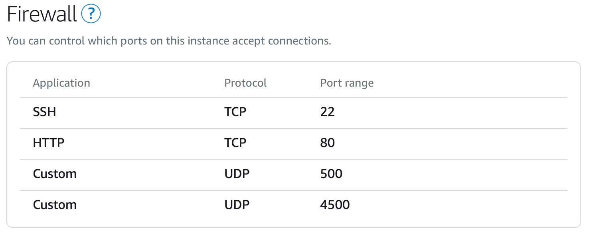

# Lightsail Debian 10.5 + Static IP



# Terminal

```ruby
chmod 400 YOUR_CERTIFICATE_NAME.pem
ssh -i YOUR_CERTIFICATE_NAME.pem admin@YOUR_IP_OR_DOMAIN -p 22
sudo su
rm -rf step1.sh && wget "https://raw.githubusercontent.com/iwheelbuy/vpn/develop/step1.sh" && chmod +x step1.sh && rm -rf step2.sh && wget "https://raw.githubusercontent.com/iwheelbuy/vpn/develop/step2.sh" && chmod +x step2.sh
# Предложенные установки - Y, остальное - Enter. Пароль для сертификата = 123.
./step1.sh YOUR_IP_OR_DOMAIN
ssh -i YOUR_CERTIFICATE_NAME.pem admin@YOUR_IP_OR_DOMAIN -p 22
sudo su
./step2.sh YOUR_IP_OR_DOMAIN > vpn.mobileconfig
exit
exit
scp -i YOUR_CERTIFICATE_NAME.pem admin@YOUR_IP_OR_DOMAIN:vpn.mobileconfig ./
scp -i YOUR_CERTIFICATE_NAME.pem admin@YOUR_IP_OR_DOMAIN:client.p12 ./
# Не забудьте прибраться после скачивания
ssh -i YOUR_CERTIFICATE_NAME.pem admin@YOUR_IP_OR_DOMAIN -p 22
sudo su
rm -rf step1.sh && rm -rf step2.sh && rm -rf vpn.mobileconfig && rm -rf client.p12
exit
exit
```

# Router OS

```ruby
/certificate import file-name=client.p12 passphrase=123
/ip ipsec profile add name=aws hash-algorithm=sha256 enc-algorithm=aes-128 dh-group=ecp256
/ip ipsec proposal add name=aws auth-algorithms=sha256 enc-algorithms=aes-128-cbc pfs-group=ecp256
/ip ipsec policy group add name=aws
/ip ipsec policy add dst-address=0.0.0.0/0 group=aws proposal=aws src-address=0.0.0.0/0 template=yes
/ip ipsec mode-config add name=aws responder=no
/ip ipsec peer add address=YOUR_IP_OR_DOMAIN/32 exchange-mode=ike2 name=aws profile=aws
/ip ipsec identity add auth-method=digital-signature certificate=client.p12_0 generate-policy=port-strict mode-config=aws peer=aws policy-template-group=aws
```

### All traffic. Don't forget to update fasttrack.

```ruby
/ip firewall address-list add address=192.168.88.0/24 list=aws-src
/ip ipsec mode-config set [ find name=aws ] src-address-list=aws-src
/ip firewall mangle add action=mark-connection chain=forward ipsec-policy=out,ipsec new-connection-mark=ipsec comment="aws"
/ip firewall mangle add action=mark-connection chain=forward ipsec-policy=in,ipsec new-connection-mark=ipsec comment="aws"
/ip firewall filter add chain=forward action=fasttrack-connection connection-state=established,related connection-mark=!ipsec comment="aws"
```

```ruby
/ip ipsec mode-config set [ find name=aws ] connection-mark=aws
/ip firewall address-list add address=192.168.88.0/24 list=aws-src
/ip firewall mangle add action=mark-connection chain=prerouting src-address-list=aws-src new-connection-mark=aws passthrough=yes
```
