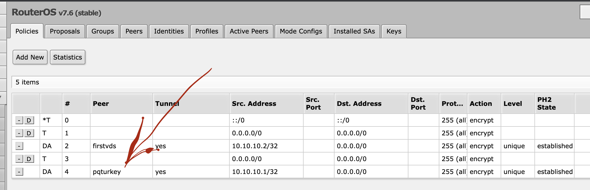
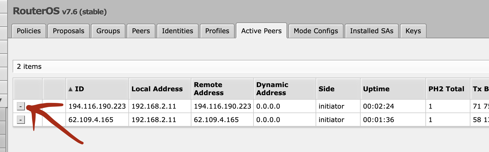

# Debian 10 + Static IP

# Lightsail


```ruby

# To be replaced: SERVER_IP_OR_DOMAIN, LIGHTSAIL_ACCESS_CERT, CERT_NAME, MIKROTIK_IPSEC_NAMESPACE, BRANCH_NAME

chmod 400 LIGHTSAIL_ACCESS_CERT.pem
ssh -i LIGHTSAIL_ACCESS_CERT.pem admin@SERVER_IP_OR_DOMAIN -p 22
sudo su
rm -rf step1.sh && wget "https://raw.githubusercontent.com/iwheelbuy/vpn/BRANCH_NAME/step1.sh" && chmod +x step1.sh && rm -rf step2.sh && wget "https://raw.githubusercontent.com/iwheelbuy/vpn/BRANCH_NAME/step2.sh" && chmod +x step2.sh
# Предложенные установки - Y, остальное - Enter. Пароль для сертификата = 123.
./step1.sh SERVER_IP_OR_DOMAIN CERT_NAME
ssh -i LIGHTSAIL_ACCESS_CERT.pem admin@SERVER_IP_OR_DOMAIN -p 22
sudo su
cp /root/CERT_NAME.p12 /home/admin/CERT_NAME.p12
rm /root/CERT_NAME.p12
./step2.sh SERVER_IP_OR_DOMAIN > vpn.mobileconfig
exit
exit
scp -i LIGHTSAIL_ACCESS_CERT.pem admin@SERVER_IP_OR_DOMAIN:vpn.mobileconfig ./
scp -i LIGHTSAIL_ACCESS_CERT.pem admin@SERVER_IP_OR_DOMAIN:CERT_NAME.p12 ./
# Не забудьте прибраться после скачивания
ssh -i LIGHTSAIL_ACCESS_CERT.pem admin@SERVER_IP_OR_DOMAIN -p 22
sudo su
rm -rf step1.sh && rm -rf step2.sh && rm -rf vpn.mobileconfig && rm -rf CERT_NAME.p12
exit
exit
```

# Other VPS providers

```ruby

# To be replaced: SERVER_IP_OR_DOMAIN, CERT_NAME, MIKROTIK_IPSEC_NAMESPACE, BRANCH_NAME

ssh root@SERVER_IP_OR_DOMAIN -p 22
rm -rf step1.sh && wget "https://raw.githubusercontent.com/iwheelbuy/vpn/BRANCH_NAME/step1.sh" && chmod +x step1.sh && rm -rf step2.sh && wget "https://raw.githubusercontent.com/iwheelbuy/vpn/BRANCH_NAME/step2.sh" && chmod +x step2.sh
# Предложенные установки - Y, остальное - Enter. Пароль для сертификата = 123.
./step1.sh SERVER_IP_OR_DOMAIN CERT_NAME
ssh root@SERVER_IP_OR_DOMAIN -p 22
./step2.sh SERVER_IP_OR_DOMAIN > vpn.mobileconfig
exit
exit
scp root@SERVER_IP_OR_DOMAIN:vpn.mobileconfig ./
scp root@SERVER_IP_OR_DOMAIN:CERT_NAME.p12 ./
# Не забудьте прибраться после скачивания
ssh root@SERVER_IP_OR_DOMAIN -p 22
sudo su
rm -rf step1.sh && rm -rf step2.sh && rm -rf vpn.mobileconfig && rm -rf CERT_NAME.p12
exit
exit
```

# Router OS

### Зайти на роутер через терминал macOS
```ruby
ssh admin@192.168.88.1
```

### Поднять IPsec
```ruby
/certificate import file-name=CERT_NAME.p12 passphrase=123
/ip ipsec profile add name=MIKROTIK_IPSEC_NAMESPACE hash-algorithm=sha256 enc-algorithm=aes-128 dh-group=ecp256
/ip ipsec proposal add name=MIKROTIK_IPSEC_NAMESPACE auth-algorithms=sha256 enc-algorithms=aes-128-cbc pfs-group=ecp256
/ip ipsec policy group add name=MIKROTIK_IPSEC_NAMESPACE
/ip ipsec policy add dst-address=0.0.0.0/0 group=MIKROTIK_IPSEC_NAMESPACE proposal=MIKROTIK_IPSEC_NAMESPACE src-address=0.0.0.0/0 template=yes
/ip ipsec mode-config add name=MIKROTIK_IPSEC_NAMESPACE responder=no
/ip ipsec peer add address=SERVER_IP_OR_DOMAIN/32 exchange-mode=ike2 name=MIKROTIK_IPSEC_NAMESPACE profile=MIKROTIK_IPSEC_NAMESPACE
/ip ipsec identity add auth-method=digital-signature certificate=CERT_NAME.p12_0 generate-policy=port-strict mode-config=MIKROTIK_IPSEC_NAMESPACE peer=MIKROTIK_IPSEC_NAMESPACE policy-template-group=MIKROTIK_IPSEC_NAMESPACE
```
### Если по какой-то причине policy не активировалась

### То стоит удалить нужного активного пира и тогда policy активируется


### Tорренты через IPsec
Адрес всей локальной сети
```ruby
/ip firewall address-list add address=192.168.88.0/24 list=torrents-local
```
Регулярки для определния торрентов
```ruby
/ip firewall layer7-protocol add name=BitTorrent regexp="\13bittorrent protocol"
/ip firewall layer7-protocol add name=DHT regexp=^d1:.d2:id20:
```
Адреса новых раздач в список торрент адресов
```ruby
/ip firewall mangle add action=add-src-to-address-list address-list=torrents-seeds address-list-timeout=1w chain=forward dst-address-list=torrents-local layer7-protocol=BitTorrent src-address-list=!torrents-seeds
/ip firewall mangle add action=add-dst-to-address-list address-list=torrents-seeds address-list-timeout=1w chain=forward dst-address-list=!torrents-seeds layer7-protocol=BitTorrent src-address-list=torrents-local
/ip firewall mangle add action=add-src-to-address-list address-list=torrents-seeds address-list-timeout=1w chain=forward dst-address-list=torrents-local layer7-protocol=DHT src-address-list=!torrents-seeds
/ip firewall mangle add action=add-dst-to-address-list address-list=torrents-seeds address-list-timeout=1w chain=forward dst-address-list=!torrents-seeds layer7-protocol=DHT src-address-list=torrents-local
```
Пометка конектов к сидам
```ruby
/ip firewall mangle add action=mark-connection chain=forward new-connection-mark=MIKROTIK_IPSEC_NAMESPACE passthrough=yes src-address-list=torrents-seeds
/ip firewall mangle add action=mark-connection chain=forward new-connection-mark=MIKROTIK_IPSEC_NAMESPACE passthrough=yes dst-address-list=torrents-seeds
```
Пометка конектов к русским сайтам, которые не открываются из-за бугра
```ruby
/ip firewall mangle add action=mark-connection chain=forward new-connection-mark=MIKROTIK_IPSEC_NAMESPACE passthrough=yes src-address-list=russia
/ip firewall mangle add action=mark-connection chain=forward new-connection-mark=MIKROTIK_IPSEC_NAMESPACE passthrough=yes dst-address-list=russia
```
Обновить fasttrack и поднять выше на место старого
```ruby
/ip firewall filter add chain=forward action=fasttrack-connection connection-state=established,related connection-mark=!MIKROTIK_IPSEC_NAMESPACE
```
Направить торренты через IPsec
```ruby
/ip ipsec mode-config set [ find name=MIKROTIK_IPSEC_NAMESPACE ] connection-mark=MIKROTIK_IPSEC_NAMESPACE
```

### Очистить торрент адреса
```ruby
/ip firewall address-list remove [/ip firewall address-list find list=torrents-seeds]
```

### Весь трафик. Не гибкое решение. Обновить fasttrack.
```ruby
/ip firewall address-list add address=192.168.88.0/24 list=MIKROTIK_IPSEC_NAMESPACE-src
/ip ipsec mode-config set [ find name=MIKROTIK_IPSEC_NAMESPACE ] src-address-list=MIKROTIK_IPSEC_NAMESPACE-src
/ip firewall mangle add action=mark-connection chain=forward ipsec-policy=out,ipsec new-connection-mark=ipsec
/ip firewall mangle add action=mark-connection chain=forward ipsec-policy=in,ipsec new-connection-mark=ipsec
/ip firewall filter add chain=forward action=fasttrack-connection connection-state=established,related connection-mark=!ipsec
```

### Весь трафик. Гибкое решение. Отключить fasttrack.
```ruby
/ip ipsec mode-config set [ find name=MIKROTIK_IPSEC_NAMESPACE ] connection-mark=MIKROTIK_IPSEC_NAMESPACE
/ip firewall address-list add address=192.168.88.0/24 list=MIKROTIK_IPSEC_NAMESPACE-src
/ip firewall mangle add action=mark-connection chain=prerouting src-address-list=MIKROTIK_IPSEC_NAMESPACE-src new-connection-mark=MIKROTIK_IPSEC_NAMESPACE passthrough=yes
```
но по-моему работает и так
```ruby
/ip ipsec mode-config set [ find name=MIKROTIK_IPSEC_NAMESPACE ] connection-mark=MIKROTIK_IPSEC_NAMESPACE
/ip firewall mangle add action=mark-connection chain=prerouting new-connection-mark=MIKROTIK_IPSEC_NAMESPACE passthrough=yes
```

### Только конкретные сайты. Гибкое решение. Отключить fasttrack.
```ruby
/ip ipsec mode-config set [ find name=MIKROTIK_IPSEC_NAMESPACE ] connection-mark=MIKROTIK_IPSEC_NAMESPACE
/ip firewall mangle add action=mark-connection chain=prerouting dst-address-list=MIKROTIK_IPSEC_NAMESPACE-dst new-connection-mark=MIKROTIK_IPSEC_NAMESPACE passthrough=yes

# protonmail

/ip firewall address-list add address=www.protonmail.com list=MIKROTIK_IPSEC_NAMESPACE-dst
/ip firewall address-list add address=mail.protonmail.com list=MIKROTIK_IPSEC_NAMESPACE-dst
/ip firewall address-list add address=protonmail.com list=MIKROTIK_IPSEC_NAMESPACE-dst
/ip firewall address-list add address=protonmail.recruitee.com list=MIKROTIK_IPSEC_NAMESPACE-dst

# rutracker

/ip firewall address-list add address=rutracker.org list=MIKROTIK_IPSEC_NAMESPACE-dst

# russia

/ip firewall address-list add address=www.pochta.ru list=russia
```

### Установить лимит скорости на каждого клиента. Отключить fasttrack.
```ruby
/queue type add kind=pcq name=pcq-upload-custom pcq-classifier=src-address pcq-rate=2M
/queue type add kind=pcq name=pcq-download-custom pcq-classifier=dst-address pcq-rate=2M
/queue simple add name=Throttle-Each queue=pcq-upload-custom/pcq-download-custom target=192.168.1.0/24
```
